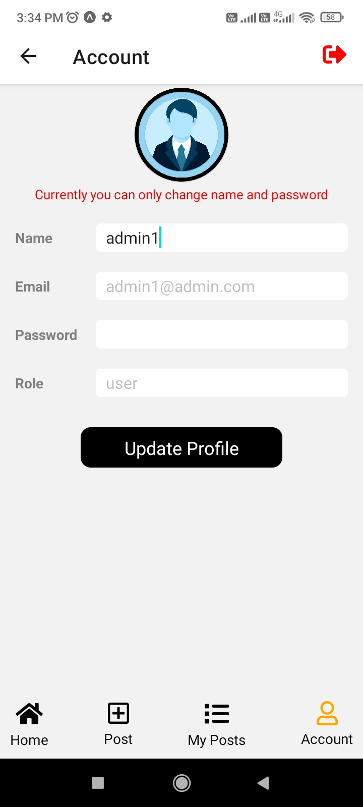
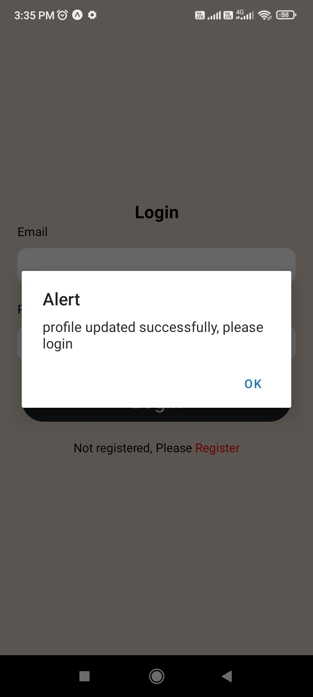

## Android Package(apk)

<a href="https://drive.google.com/file/d/1YZwjLTLLTVrvnHKY_dZ0r6YaPF1tuRTV/view?usp=sharing">Notes app Android Build Package(apk)</a>

## Backend deployed

https://production-rn-notes-server.onrender.com/api/v1

Example: https://production-rn-notes-server.onrender.com/api/v1/post/posts-list

## Screenshots

    
    
    
    
    
    
    
    
    
    
    
    
    
    

